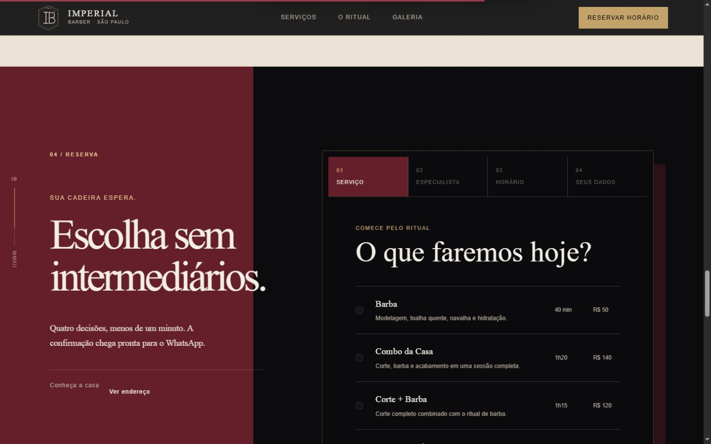
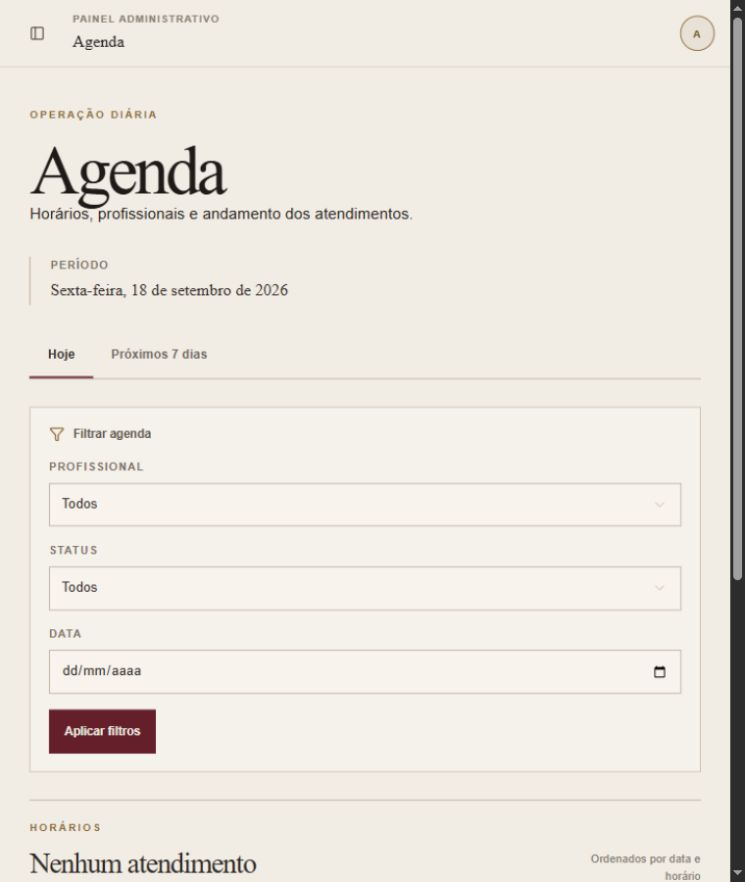
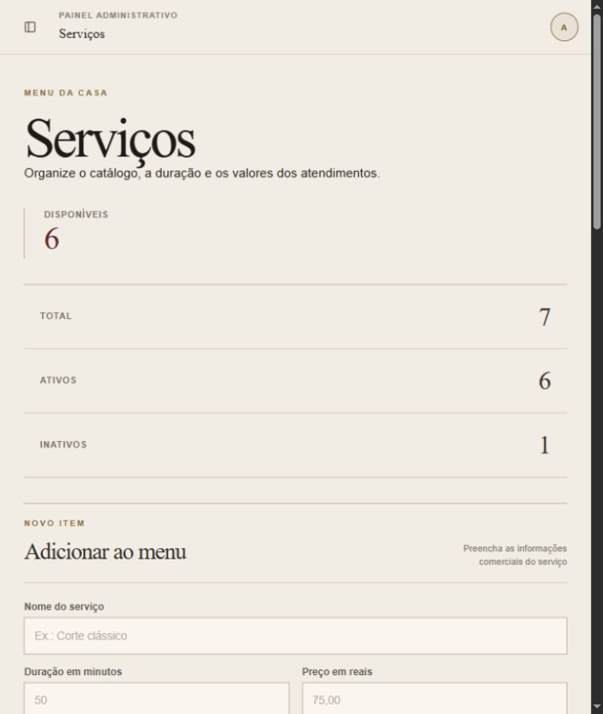
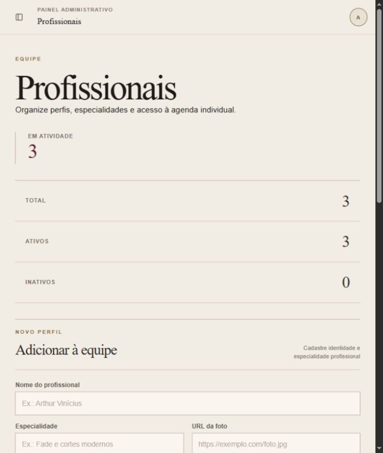

# Imperial Barber

**Web App Full-Stack para gestão e agendamento de uma barbearia.**

[Visualizar projeto publicado](https://projeto-imperial-barber.contato-v1nydev.workers.dev) · [Acessar o painel](https://projeto-imperial-barber.contato-v1nydev.workers.dev/admin/login)


## Visão geral

A Imperial Barber nasceu como uma landing page conceitual e evoluiu para uma aplicação full-stack demonstrável. A experiência pública apresenta a marca, consulta o catálogo e a disponibilidade reais e permite concluir um agendamento. Em paralelo, um painel protegido concentra a rotina operacional da barbearia.

O projeto combina uma direção de arte editorial com fluxos claros, responsividade e persistência segura no Supabase. Seu objetivo é demonstrar, em um único case, competências de UI/UX, frontend, backend, banco de dados, autenticação e deploy.

## Problema, proposta e solução

Barbearias pequenas frequentemente distribuem sua operação entre mensagens, planilhas e agendas manuais. Isso dificulta consultar horários, manter o catálogo atualizado e acompanhar os atendimentos.

A proposta foi criar uma presença digital que não terminasse na vitrine: o mesmo produto deveria atender o cliente e organizar a operação. A solução reúne um agendamento público guiado e um painel administrativo responsivo, conectados à mesma fonte de dados e protegidos por autenticação, validações e Row Level Security.

## Principais funcionalidades

### Experiência pública

- landing page editorial, responsiva e com animações orientadas por scroll;
- catálogo de serviços e profissionais carregado do banco;
- consulta de disponibilidade por serviço, profissional e data;
- criação de agendamento com validação e prevenção de conflitos;
- confirmação pós-agendamento e tratamento de estados de carregamento e erro.

### Painel administrativo

- autenticação com Supabase Auth e rotas protegidas;
- dashboard com resumo operacional, indicadores e próximos atendimentos;
- agenda com filtros e visualizações de atendimentos;
- gestão e alteração de status dos agendamentos;
- gestão de serviços, profissionais e configurações essenciais;
- layout responsivo para desktop e dispositivos móveis.

## Screenshots

| Agendamento público | Login administrativo |
| --- | --- |
|  |  |

| Dashboard | Agenda |
| --- | --- |
|  |  |

| Gestão de agendamentos | Serviços |
| --- | --- |
|  |  |

| Profissionais | Versão mobile |
| --- | --- |
|  |  |

## Stack

- **Interface:** React 19, Next.js 16 App Router, TypeScript e CSS responsivo;
- **Componentes:** Base UI, shadcn, Lucide e utilitários Tailwind;
- **Formulários e validação:** React Hook Form e Zod;
- **Backend:** Server Components, Server Actions e Route Handlers;
- **Dados e autenticação:** Supabase Auth, PostgreSQL, RPCs, RLS e migrations SQL;
- **Qualidade:** TypeScript, ESLint e testes pgTAP do banco;
- **Runtime e deploy:** Vinext/Vite em Cloudflare Workers.

## Arquitetura

```text
Navegador
├── Landing e agendamento público
│   └── /api/public/catalog | availability | bookings
└── Painel administrativo protegido
    └── Server Components e Server Actions
                │
                ▼
     Supabase Auth + PostgreSQL
     RLS · RPCs · constraints · índices
```

O navegador recebe apenas a configuração pública de baixo privilégio do Supabase. A autorização administrativa é verificada no servidor e reforçada no banco por políticas de RLS. Regras críticas do agendamento vivem em funções transacionais no PostgreSQL, reduzindo condições de corrida e divergências entre interfaces.

Uma descrição técnica mais completa está em [docs/ARCHITECTURE.md](docs/ARCHITECTURE.md). O modelo de dados e a autenticação estão documentados em [docs/DATABASE.md](docs/DATABASE.md) e [docs/AUTHENTICATION.md](docs/AUTHENTICATION.md).

## Execução local

### Pré-requisitos

- Node.js `>= 22.13.0`;
- npm;
- um projeto Supabase configurado com as migrations deste repositório.

### Configuração

```bash
git clone https://github.com/v1nydev/PROJETO-IMPERIAL-BARBER.git
cd PROJETO-IMPERIAL-BARBER
npm ci
```

Copie `.env.example` para `.env.local` e preencha:

```env
NEXT_PUBLIC_SUPABASE_URL=https://seu-projeto.supabase.co
NEXT_PUBLIC_SUPABASE_PUBLISHABLE_KEY=sua-chave-publicavel
```

Nunca use uma chave `service_role` em variáveis `NEXT_PUBLIC_*` nem versione o arquivo `.env.local`.

Inicie o ambiente:

```bash
npm run dev
```

A aplicação ficará disponível em `http://localhost:5173`. O painel usa `/admin/login`; por segurança, credenciais administrativas não são publicadas no repositório e devem pertencer a um usuário autorizado no Supabase.

Para preparar o banco, consulte [docs/DATABASE.md](docs/DATABASE.md). O fluxo opcional com Supabase CLI requer Docker para o ambiente local.

### Validação

```bash
npm run typecheck
npm run lint
npm run build
```

Os scripts `supabase:lint` e `supabase:test` validam migrations, políticas e testes pgTAP quando a stack local do Supabase estiver ativa.

## Status

**Portfolio Release concluída.** O escopo atual é uma demonstração conceitual e funcional; pagamentos, notificações automáticas, CRM, múltiplas unidades e recursos de SaaS permanecem fora desta versão.

## Créditos

Conceito, design e desenvolvimento por **V1NY.DEV** — [GitHub](https://github.com/v1nydev).
